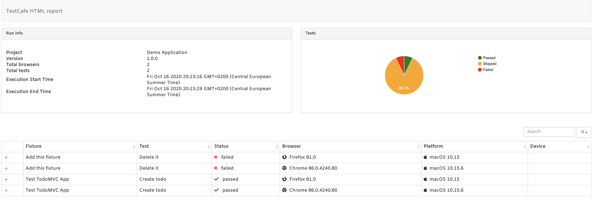
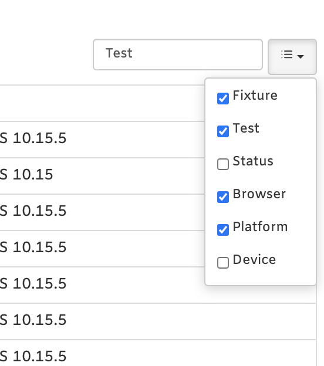

# TestCafé Reporter Multiple Html

This is the **HTML** reporter plugin for [TestCafé](http://devexpress.github.io/testcafe). 

This TestCafé reporter generates an HTML report with default support for stackTrace, screenshots sorting and searching.

<p align="center">
  
</p>

Layout inspired by the [multiple-cucumber-html-reporter](https://github.com/wswebcreation/multiple-cucumber-html-reporter)

## To install this TestCafé Reporter

- run the command:

  ```sh
  npm install --save testcafe-reporter-multiple-html
  ```

## Usage

- add to the TestCafé command-line the following options:

  ```sh
  testcafe chrome ./path-to-tests/*(.js|.testcafe|.ts) --reporter multiple-html
  ```

HTML report will automatically be created in a folder named `.report` at the root of your project.

If you need to change this folder, add this option on the TestCafé command-line:

```sh
--reporter-html-folder='my-custom-folder'
```

or add/edit the `args` section inside the `testcafe-reporter-multiple-html.json` configuration file:

```json
  "args": {
    "reportFolder": "my-custom-folder"
  }
```

At each TestCafé run, this reporter will create a separate HTML file with timestamp of run start


If you would like to show in the report the App name targeted by your tests, add this option on the TestCafé command-line:

```sh
--reporter-app-name='My App'
```

or add/edit the `args` section inside the `testcafe-reporter-multiple-html.json` configuration file:

```json
  "args": {
    "appName": "My App",
  }
```

And if you need to also show the App version, add this option on the TestCafé command-line:

```sh
--reporter-app-version='x.y.z'
```

or add/edit the `args` section inside the `testcafe-reporter-multiple-html.json` configuration file:

```json
  "args": {
    "appVersion": "x.y.z",
  }
```


## Filtering & Searching

<p align="center">
  
</p>
- the reporter supports sorting on all columns, disabling enabling of columns and searching


## Error and screenshot reporting

- this reporter will report the error in the extended details of a report row

<p align="center">
  
</p>

